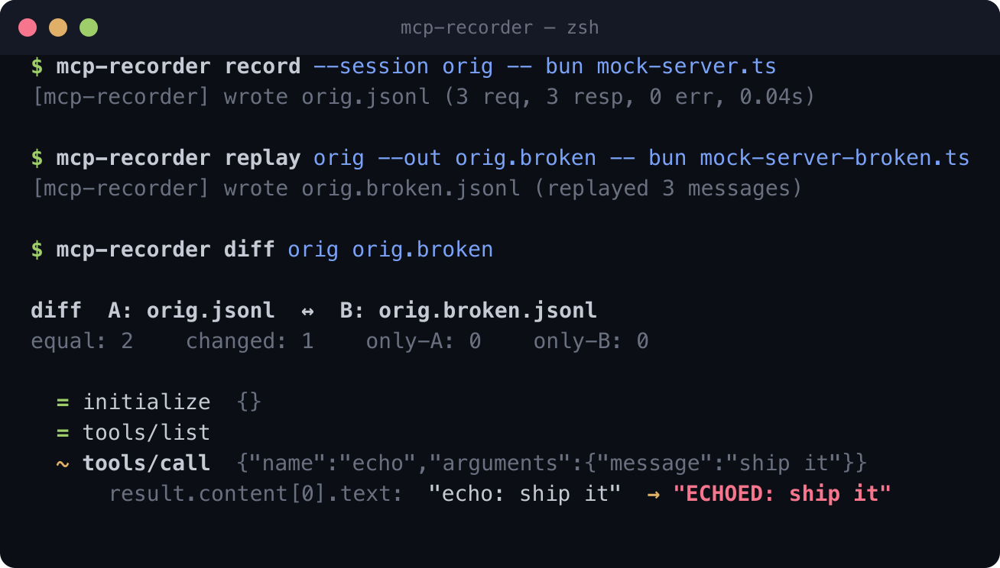

# mcp-recorder

> Record, replay, and diff every MCP session. Catch silent regressions before your agent does.

A record-and-replay debugger for the [Model Context Protocol](https://modelcontextprotocol.io). Sits transparently between an MCP client (Claude Code, Cursor, Zed) and an MCP server, logs every JSON-RPC message flowing in either direction to a JSONL file, and — in upcoming versions — replays recorded sessions against a fresh server with semantic diffing to catch regressions.

**Status: v0.2 — `record`, `list`, `show`, `replay`, `diff` all working. Server-change regressions are caught in 1 command.**



## Why

When you change an MCP server — rename a tool, tighten a schema, refactor a handler — nothing tells you whether existing agents still work. The debug loop today is: change code, restart Claude Code, re-prompt, squint at outputs. `mcp-recorder` replaces that with **record once, replay forever, diff automatically.**

## Install

```bash
git clone https://github.com/toddegray/mcp-recorder.git
cd mcp-recorder && bun install
bun src/cli.ts --help

# optional single binary
bun run build        # produces ./bin/mcp-recorder
```

Requires [Bun](https://bun.sh).

## Use

Change your MCP client's server config from:

```json
{
  "mcpServers": {
    "filesystem": {
      "command": "npx",
      "args": ["@modelcontextprotocol/server-filesystem", "/tmp"]
    }
  }
}
```

to:

```json
{
  "mcpServers": {
    "filesystem": {
      "command": "mcp-recorder",
      "args": [
        "record", "--session", "fs-debug", "--",
        "npx", "@modelcontextprotocol/server-filesystem", "/tmp"
      ]
    }
  }
}
```

That's it. One line. The recorder is byte-for-byte transparent — if mcp-recorder dies, the client sees the pipe close, same as calling the server directly.

Use Claude Code / Cursor / Zed normally, then:

```bash
mcp-recorder list
mcp-recorder show fs-debug
mcp-recorder show fs-debug --filter tools/call --slow 500
```

## Example

A tiny session against the mock server bundled for tests:

```
$ mcp-recorder show demo --dir tmp

session tmp/demo.jsonl
server: bun test/fixtures/mock-server.ts    duration: 0.04s    requests: 3    responses: 3    notifications: 0    errors: 0

  → initialize  {} 17ms
  → tools/list   16ms
  → tools/call  {"name":"echo","arguments":{"message":"hello from demo"}} 16ms
```

Request/response pairs are automatically matched by `id`, so every line shows the tool call plus the round-trip latency. Errors are flagged in red; slow calls in yellow.

## Architecture

```
┌─────────────┐    stdio    ┌─────────────────┐    stdio    ┌───────────────┐
│ MCP client  │◄───────────►│  mcp-recorder   │◄───────────►│  MCP server   │
│ (Claude     │             │  (transparent   │             │  (filesystem, │
│  Code, etc) │             │   middleman)    │             │   gbrain, ...)│
└─────────────┘             └────────┬────────┘             └───────────────┘
                                     │
                                     ▼
                          ┌──────────────────────┐
                          │ ~/.mcp-recorder/     │
                          │   sessions/*.jsonl   │
                          └──────────────────────┘
```

- **Insertion point:** stdio. The recorder spawns the real server as a child and wires four pipes (`client_stdin ↔ child.stdin`, `child.stdout ↔ client_stdout`). Bytes are forwarded *before* being parsed, so the recorder never adds latency to the critical path.
- **Framing:** newline-delimited JSON-RPC 2.0, per MCP spec §3.1. A small stateful line-framer ([src/framing.ts](src/framing.ts)) handles partial reads, malformed lines, batched requests, and classifies every message into `request` / `response` / `notification` / `batch` / `malformed` without interpreting MCP semantics.
- **Storage:** one JSONL file per session. One line per observed message, plus a trailing summary. Grep-friendly, human-readable.

## Session file format

```jsonc
{"seq":0,"t":1776658414.952,"dir":"c2s","msg":{"jsonrpc":"2.0","id":1,"method":"initialize","params":{}}}
{"seq":1,"t":1776658414.983,"dir":"s2c","msg":{"jsonrpc":"2.0","id":1,"result":{"protocolVersion":"2024-11-05","capabilities":{"tools":{}}}}}
...
{"type":"summary","startedAt":1776658414.952,"endedAt":1776658414.993,"durationSec":0.041,"requests":3,"responses":3,"notifications":0,"batches":0,"malformed":0,"errors":0,"server":{"command":"npx","args":["@modelcontextprotocol/server-filesystem","/tmp"]}}
```

Fields:
- `seq` — monotonic. Makes pairing deterministic across replays.
- `t` — Unix seconds (float, μs precision).
- `dir` — `c2s` (client → server) or `s2c` (server → client).
- `msg` — the JSON-RPC message verbatim. Malformed frames become a string with `malformed: true`.

## Commands

```
mcp-recorder record [--session <name>] [--dir <path>] -- <cmd> [args...]
mcp-recorder list   [--dir <path>]
mcp-recorder show   <session> [--filter <method>] [--slow <ms>] [--json] [--no-color] [--dir <path>]
mcp-recorder replay <session> [--out <name>] [--dir <path>] -- <cmd> [args...]
mcp-recorder diff   <session-a> <session-b> [--no-color] [--dir <path>]
```

`record` has **no chatter on stdout** — it would corrupt the JSON-RPC stream. Status messages go to stderr after the session closes, so client↔server passthrough is pure.

## Catching regressions

The whole point:

```bash
# 1. record a session against your current server
mcp-recorder record --session before -- node my-mcp-server.js

# 2. refactor the server

# 3. replay yesterday's session against the refactored server
mcp-recorder replay before --out after -- node my-mcp-server.js

# 4. diff
mcp-recorder diff before after
```

`diff` exits **0** if the sessions are semantically equivalent (after normalizing ids, timestamps, UUIDs, and configured path prefixes), **1** if any request's response changed, was added, or was dropped. CI-friendly by design:

```yaml
# .github/workflows/mcp-regression.yml
- run: mcp-recorder replay baseline --out replayed -- node server.js
- run: mcp-recorder diff baseline replayed
```

### What "semantically equivalent" means

The diff engine normalizes the following before comparing:

- **Request/response `id`s** — the replay server assigns its own
- **ISO-8601 timestamps** anywhere inside message content
- **UUIDs** (8-4-4-4-12 hex pattern)
- **Absolute path prefixes** (configurable)
- **Arrays tagged as order-independent** (configurable, e.g. `tools` by `name`)

Anything that survives normalization is treated as signal. A real code change to a tool's output shows up; a fresh UUID doesn't.

## Replay semantics

- Only client→server **requests** and notifications are replayed, in original `seq` order.
- Each request waits for its response before the next one is sent (strictly deterministic).
- Server→client requests (e.g. `sampling/createMessage` from bidirectional MCP) are auto-answered by looking up the client's original response by method + stable params hash. If there's no match, replay errors loudly — better than guessing.
- The new session is written as `<original-name>.replay.jsonl` (overridable with `--out`).

## Roadmap

- **v0.3 — `serve`.** Expose `list`/`show`/`diff`/`replay` as MCP tools so agents can audit their own tool-use history.
- **v0.3 — TOML config.** `.mcp-recorder.toml` for per-project normalization rules (path prefixes, sorted-array keys, numeric tolerance).
- **later.** HTTP/SSE transport, web viewer, zstd compression, per-argument redaction.

See [docs/spec.md](docs/spec.md) for the full design spec.

## Development

```bash
bun test            # all tests (framing, session, end-to-end via mock server)
```

The end-to-end test ([test/record.e2e.test.ts](test/record.e2e.test.ts)) spawns the CLI's `record` command with a mock MCP server as its child, drives a real protocol conversation through it, and asserts every message was logged correctly on both directions — the same pipeline a real client uses.

The **regression-catching test** ([test/replay-diff.e2e.test.ts](test/replay-diff.e2e.test.ts)) does a full record → replay → diff round-trip against two mock servers — one normal, one with a deliberately-broken tool output — and asserts the diff catches exactly the regression and nothing else. This is the headline capability.

## License

MIT
